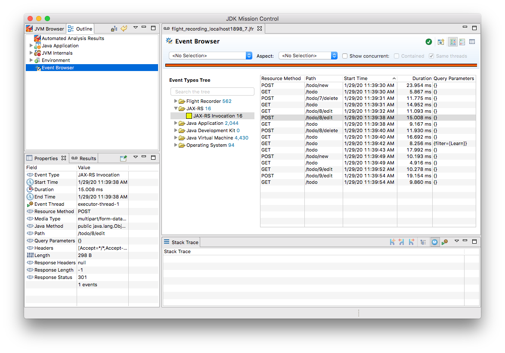
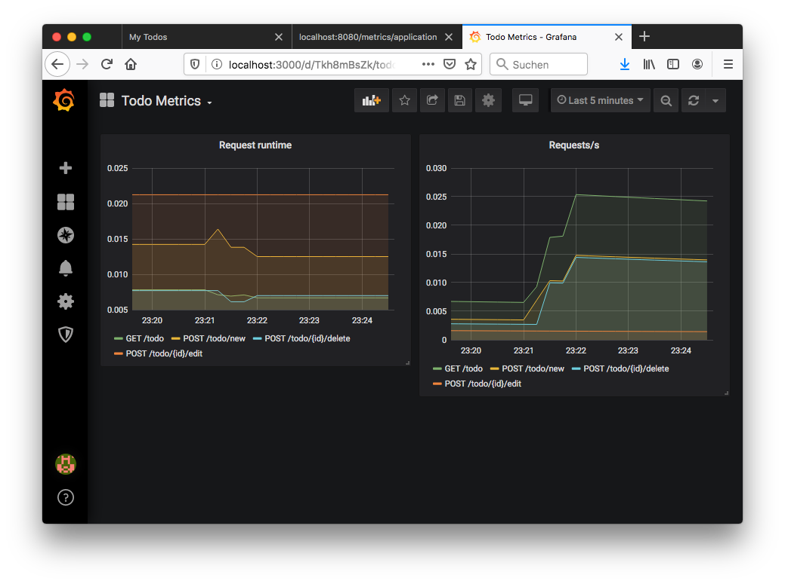
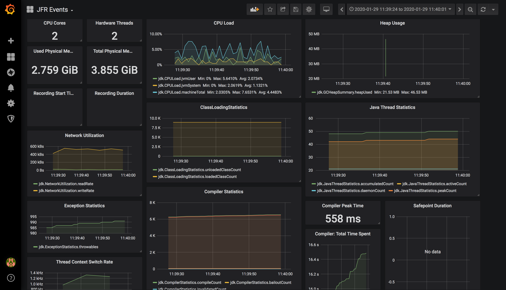

# JDK Flight Recorder Custom Events

Example code accompanying the [blog post](https://www.morling.dev/blog/rest-api-monitoring-with-custom-jdk-flight-recorder-events/) "Monitoring REST APIs with JDK Flight Recorder Custom Events".
It shows how to use custom event types with JDK Flight Recorder and Mission Control to gain insight into runtime performance of a JAX-RS based REST API.
It also demonstrates how to export Flight Recorder events in realtime via MicroProfile Metrics, using the JDK Flight Recorder event streaming API ([JEP 349](https://openjdk.java.net/jeps/349)) added in Java 14.





Update Feb. 8th: the example has been expanded to show the usage of the [JFR datasource](https://github.com/rh-jmc-team/jfr-datasource) for Grafana.

## Build

Make sure to have Java 14 installed.
Run the following to build this project:

```shell
# Example service
mvn clean package -f example-service/pom.xml

# JFR datasource for Grafana
mvn clean package -f jfr-datasource/pom.xml

docker-compose up --build
```

Open the web application at http://localhost:8080/.
You then can connect to the running application on port 1898 using Mission Control,
start Flight Recorder and observe "JAX-RS" events in the recording.
You also can observe the exported metrics via Grafana at http://localhost:3000/.

### Dev Mode

When working on the example service, it can be started in the Quarkus dev mode instead of packaging it as a container image for faster feedback;

```shell
docker-compose up --build --scale example-service=0

mvn compile quarkus:dev -f example-service/pom.xml
```

When starting a recording, make sure to use the process for _target/flight-recorder-demo-dev.jar_.

## Loading JFR Recordings into Grafana

The JFR datasource has been setup in Grafana.
To examine a JFR recording, load it into the datasource:

```shell
curl -F "file=@/path/to/my/recording.jfr" localhost:8081/load
```

Then open the "JFR Events" dashboard in Grafana and zoom into the time range of the recording.



# License

This code base is available ander the Apache License, version 2.
